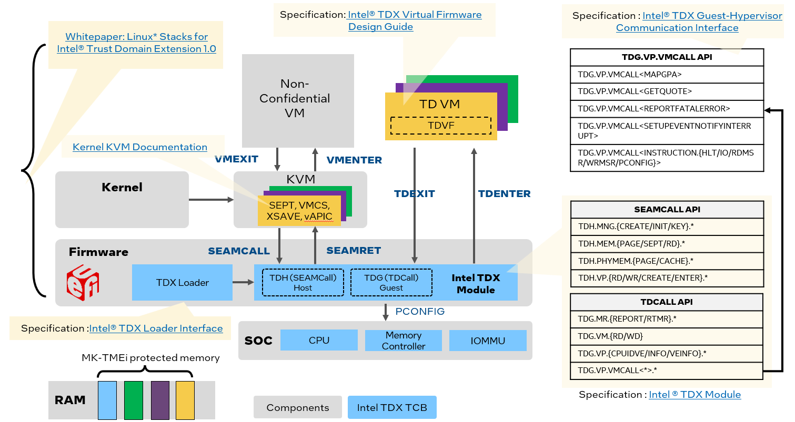

# Linux Stack for Intel&reg; TDX (Trust Domain Extensions)

## 1. Overview

### 1.1 Intel&reg; Trust Domain Extensions(TDX)
Intel&reg; Trust Domain Extensions(TDX) refers to an Intel technology that
extends Virtual Machine Extensions(VMX) and Multi-Key Total Memory
Encryption(MK-TME) with a new kind of virtual machine guest called a Trust
Domain(TD). A TD runs in a CPU mode that protects the confidentiality of its
memory contents and its CPU state from any other software, including the hosting
Virtual Machine Monitor (VMM). Please get more details from _[TDX White Papers and Specifications](https://github.com/intel/tdx-tools/wiki/API-&-Specifications)_

### 1.2 Hardware Availability

- Azure already [launched](https://azure.microsoft.com/en-us/updates/confidential-vms-with-intel-tdx-dcesv5-ecesv5/) the
  TDX based confidential computing at zone of `DCesv5` and `ECesv5` series.
- Google published [Intel Trust Domain Extensions (TDX) Security Review](https://services.google.com/fh/files/misc/intel_tdx_-_full_report_041423.pdf)
- Please contact Intel sales representative for on-premise bare metal server or processor.

### 1.3 API and Specifications

Please see details at [here](https://github.com/intel/tdx-tools/wiki/API-&-Specifications):

## 2. Linux Stack for Intel TDX

Linux Stack for Intel&reg; TDX is an end-to-end hypervisor cloud stack including the Infrastructure as a Service (IaaS) and
Platform as a Service (PaaS) components.

### 2.1 Use Cases

It produce the following minimal use cases:

- Launch Intel® TDX guest VM to run general computing workloads
- Do launch-time measurement within the Intel® TDX guest VM
- Do runtime attestation with the quote generated by Intel® Software Guard Extensions (Intel® SGX)-based quote generation
  service (QGS) on the IaaS host

It provides the below tools for developer:
- Build individual component's package or install pre-build binaries on IaaS host or create PaaS guest image for quick evaluation
- Generate the patch set for deep dive in source code level
- Test, hack and debug the TDX technology based on [PyCloudStack](utils/pycloudstack/README.md) framework
- Dump guest VM measurement and generate TD quote report for TDX E2E attestation
- Measured boot and Secure boot for TDX guest VM

### 2.2 Releases

tdx-tools keeps evolving along with kernel version. It supports kernel 5.15, kernel 5.19 and
kernel 6.2. Please refer to corresponding _[tag](https://github.com/intel/tdx-tools/tags)_
for different kernel version support. Please make sure to use the corresponding tag aligned with kernel version.
| Tag | Kernel version | Description |
| -- | -- | -- |
| [2022ww44](https://github.com/intel/tdx-tools/releases/tag/2022ww44) | 5.15 |TDX 1.0 |
| [2023ww01](https://github.com/intel/tdx-tools/releases/tag/2023ww01) | 5.19 |TDX 1.0 |
| [2023ww15](https://github.com/intel/tdx-tools/releases/tag/2023ww15) | 6.2 |TDX 1.5 |

### 2.3 Components

Linux Stack for Intel&reg; TDX includes the components in below diagram:

| Name | Stack | Description |
| -- | -- | -- |
| TDX Kernel | Host + Guest | Linux kernel for TDX |
| TDX Qemu-KVM | Host | Qemu VMM for TDX |
| TDX SEAM Module | Host | TDX Secure Arbitration Module |
| [TDX Libvirt](https://github.com/intel/libvirt-tdx) | Host | The modified libvirt to create TDX guest domain via Qemu |
| [TDVF](https://github.com/tianocore/edk2) | Host | The modified OVMF(Open Source Virtual Firmware) to support TDX guest boot like page accept, TDX measurement |
| [TDX Grub2](https://github.com/intel/grub-tdx) | Guest | The modified grub for guest VM to support TDX measurement |
| [TDX shim](https://github.com/intel/shim-tdx) | Guest | The modified shim for guest VM to support TDX measurement |

## 3. How to Use

Please refer the white paper: [Linux*Stacks for Intel® Trust Domain
Extension 1.0](https://www.intel.com/content/www/us/en/content-details/779108/whitepaper-linux-stacks-for-intel-trust-domain-extension-1-0.html) (only cover TDX 1.0)
and [wiki](https://github.com/intel/tdx-tools/wiki) for additional informational about TDX 1.5 or developer specific.

| Type | Content |
| ---- | ------- |
| BKM  | [Check Memory Encryption](https://github.com/intel/tdx-tools/wiki/BKM:-Check-Memory-Encryption) |
| BKM  | [Enable IMA with TDX RTMR](https://github.com/intel/tdx-tools/wiki/BKM:-Enable-IMA-with-TDX-RTMR) |
| Developer  | [Developer Guide](https://github.com/intel/tdx-tools/wiki/Developer:-Developer-Guide) |
| Developer  | [Off TD GDB Debug](https://github.com/intel/tdx-tools/wiki/Developer:-Off-TD-GDB-Debug) |
| 1.5  | [TD Migration](https://github.com/intel/tdx-tools/wiki/TDX-1.5:-TD-Migration) |