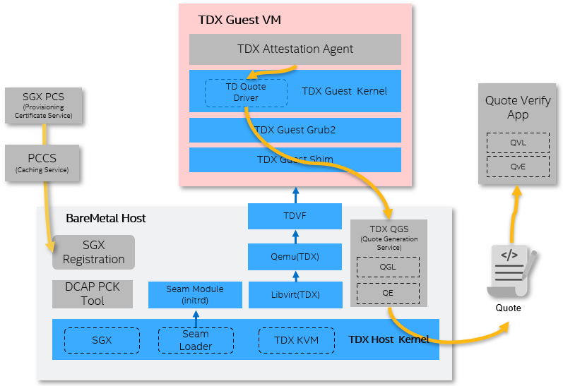

# Linux Stack for Intel&reg; TDX (Trust Domain Extensions)


## 1. Overview

Intel&reg; Trust Domain Extensions(TDX) refers to an Intel technology that
extends Virtual Machine Extensions(VMX) and Multi-Key Total Memory
Encryption(MK-TME) with a new kind of virtual machine guest called a Trust
Domain(TD). A TD runs in a CPU mode that protects the confidentiality of its
memory contents and its CPU state from any other software, including the hosting
Virtual Machine Monitor (VMM). Please get more details from _[TDX White Papers and Specifications](https://www.intel.com/content/www/us/en/developer/articles/technical/intel-trust-domain-extensions.html)_

This repository helps to:

- Build individual component's package or install pre-build binaries on IaaS
host or create PaaS guest image for quick evaluation
- Generate the patchsets for deep dive in source code level
- Test, hack and debug the TDX technology based on [pycloudstack](utils/pycloudstack/README.md) framework
- Dump guest VM measurement and generate TD quote report for TDX E2E attestation
- Measured boot and Secure boot for TDX guest VM

tdx-tools keeps evolving along with kernel version. It supports kernel 5.15, kernel 5.19 and
kernel 6.2. Please refer to corresponding _[tag](https://github.com/intel/tdx-tools/tags)_
for different kernel version support. Please make sure to use the corresponding tag aligned with kernel version.
| Tag | Kernel version | Description |
| -- | -- | -- |
| [2022ww44](https://github.com/intel/tdx-tools/releases/tag/2022ww44) | 5.15 |TDX 1.0 |
| [2023ww01](https://github.com/intel/tdx-tools/releases/tag/2023ww01) | 5.19 |TDX 1.0 |
| [2023ww15](https://github.com/intel/tdx-tools/releases/tag/2023ww15) | 6.2 |TDX 1.5 |

## 2. Components

Linux Stack for Intel&reg; TDX includes the components in
below diagram:



| Name | Stack | Description |
| -- | -- | -- |
| TDX Kernel | Host + Guest | Linux kernel for TDX |
| TDX Qemu-KVM | Host | Qemu VMM for TDX |
| TDX SEAM Module | Host | TDX Secure Arbitration Module |
| [TDX Libvirt](https://github.com/intel/libvirt-tdx) | Host | The modified libvirt to create TDX guest domain via Qemu |
| [TDVF](https://github.com/tianocore/edk2) | Host | The modified OVMF(Open Source Virtual Firmware) to support TDX guest boot like page accept, TDX measurement |
| [TDX Grub2](https://github.com/intel/grub-tdx) | Guest | The modified grub for guest VM to support TDX measurement |
| [TDX shim](https://github.com/intel/shim-tdx) | Guest | The modified shim for guest VM to support TDX measurement |

## 3. Getting Started

### 3.1 Install TDX Linux Stack

#### 3.1.1 Build Packages from scratch

To build all components, run the following commands:

```
cd build/rhel-8
./build-repo.sh
```

_NOTE:_ Please refer detail instructions for different distros in `build`
directory. It requires at least 45G space, and could take several hours to complete.

This will build all packages and create two repositories, one for guest and one for host.

#### 3.1.1 Install RPM repo on the target host

Move the host repo to a known location:

```
sudo mkdir -p /srv/
sudo mv repo/host /srv/tdx-host
```

To use the repo, create the following file as `/etc/yum.repos.d/tdx-host-local.repo`:

```
[tdx-host-local]
name=tdx-host-local
baseurl=file:///srv/tdx-host
enabled=1
gpgcheck=0
module_hotfixes=true
```

Finally, install packages as follows:

```
sudo dnf install intel-mvp-tdx-kernel intel-mvp-ovmf intel-mvp-tdx-qemu-kvm intel-mvp-tdx-libvirt
```

_NOTE_: Please get separated RPM for signed build `TDX SEAM Module` and install via
`sudo dnf install intel-mvp-tdx-module`. After installation, please reboot
machine with `tdx_host=on numa_balancing=disable` in host kernel command via grub menu. Finally, please
[verify TDX host](./doc/verify_tdx_host.md).

### 3.2 Prepare TDX Guest Image

After building TDX components packages please refer to [Setup TDX Guest Image](/doc/create_guest_image.md) to install
them into a cloud image. It uses `RHEL 8.7` as an example distro.

## 4. Launch TD VM Guest

You can [start-qemu.sh](/start-qemu.sh) to create TD guest quickly as below.
Please get detail grub/direct boot template for qemu-kvm and libvirt at [Launch TD Guest](/doc/launch_td_guest.md).

- Launch a TDX guest via direct boot

```
./start-qemu.sh -i td-guest-rhel-8.7.qcow2 -k vmlinuz-rhel-8.7
```

- Launch a TDX guest via grub boot

```
./start-qemu.sh -i td-guest-rhel-8.7.qcow2 -b grub
```

- Launch a debug version TDX guest with debug version OVMF

```
./start-qemu.sh -i td-guest-rhel-8.7.qcow2 -k vmlinuz-rhel-8.7 -d
```

- Launch a non-TDX guest

```
./start-qemu.sh -i td-guest-rhel-8.7.qcow2 -k vmlinuz-rhel-8.7 -t efi
```

## 5. Test

After TDX guest image is created, please refer to [TDX Tests](/doc/run_tests.md) to run tests. It uses
`RHEL 8.7` as example distro.

## 6. FAQ & BKM

- [How to check memory encryption for TDX guest](/doc/check_memory_encryption.md)
- [How to debug a TDX guest via Qemu GDB server](/doc/debug_td_guest.md)
- [Secure boot for TDX](./doc/secure_boot.md)
- [Measured boot and TDX tool](./attestation/pytdxmeasure/README.md)
